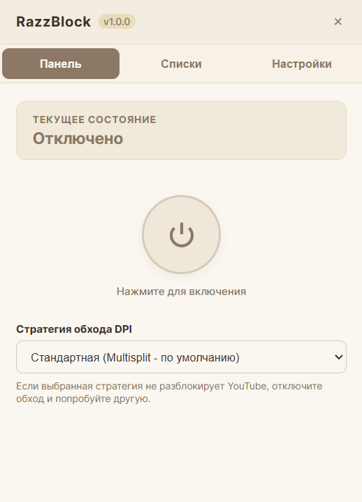
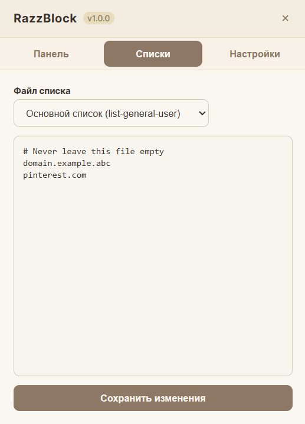
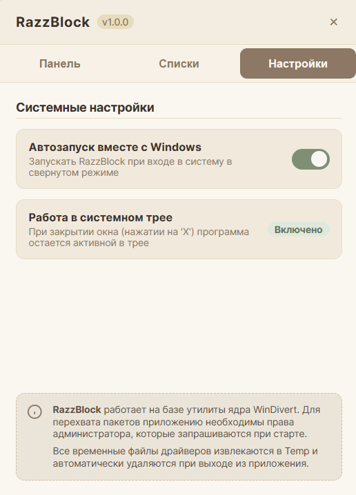

# RazzBlock

Простая и автономная Windows-утилита для обхода DPI блокировок (YouTube, Discord и др.) без использования VPN. Она полностью портативна, состоит из одного `.exe` файла и не оставляет мусора в системе.

## Скриншоты




## Особенности
* **Один файл**: Драйвер перехвата пакетов и исполняемые файлы вшиты внутрь приложения.
* **Чистый жизненный цикл**: Распаковывается во временную папку `%TEMP%` при запуске и полностью удаляет её при выходе.
* **Автоподбор**: Функция автоматического тестирования и подбора рабочей стратегии обхода для YouTube.
* **Редактор списков**: Управление вашими личными доменами обхода и исключениями прямо в интерфейсе приложения.
* **Автозапуск и трей**: Удобное сворачивание в системный трей и автозапуск в скрытом режиме при старте Windows.

## Установка и запуск
1. Скачайте `RazzBlock.exe` из раздела [Releases](https://github.com/BlackSnowSkill/RazzBlock/releases).
2. Запустите программу (UAC запрос на права администратора появится автоматически для старта драйвера перехвата пакетов).
3. Выберите стратегию обхода (или «Автоподбор») и нажмите кнопку включения на главном экране.

## Сборка из исходников

### Требования:
* Node.js (версия 18+)
* Rust / Cargo (инструментарий MSVC)

### Инструкция:
```bash
npm install
npm run tauri build
```
Готовый файл появится в папке `src-tauri/target/release/RazzBlock.exe`.
